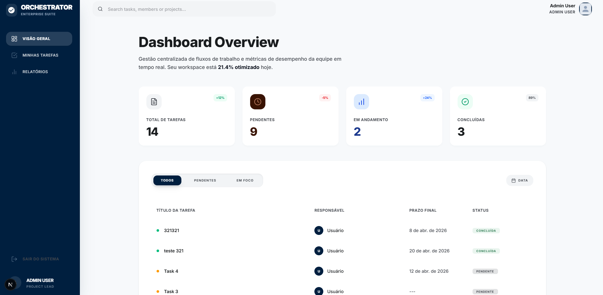

# Cubo Task Management



Este projeto é um sistema de gerenciamento de tarefas de alto desempenho, desenvolvido como uma solução "Production Ready". Ele une uma API robusta em Laravel com uma interface moderna e otimizada em Next.js, focando em escalabilidade, resiliência e automação total para o desenvolvedor e o recrutador.

---

## 🛠 Stack Tecnológica & Diferenciais

O projeto utiliza o que há de mais moderno no ecossistema PHP e Javascript, configurado para máxima performance.

| Camada | Tecnologia | Destaque de Engenharia |
| :--- | :--- | :--- |
| **Backend** | Laravel 11 (PHP 8.4) | Build otimizado com cache de rotas e configurações. |
| **Frontend** | Next.js 15 (Node 20+) | **Standalone Build** para containers ultra-leves e rápidos. |
| **Infraestrutura** | Docker & Compose | Resiliência com Healthchecks e dependências inteligentes. |
| **Banco de Dados** | MySQL 8.0 | Persistência robusta com volumes isolados. |

### 🛡️ Resiliência e Orquestração
Diferente de setups básicos, este ambiente foi configurado com foco em estabilidade:
- **Healthchecks:** O banco de dados possui uma verificação de saúde ativa.
- **Dependency Control:** A API e o Frontend aguardam o banco estar totalmente "Saudável" antes de iniciarem, evitando erros de conexão no bootstrap.
- **Restart Policy:** Todos os serviços utilizam `restart: unless-stopped`, garantindo que o sistema se recupere sozinho de eventuais falhas.

---

## 🚀 Setup Automatizado (Zero Touch)

O processo de instalação foi totalmente automatizado para que o sistema suba pronto para uso imediato.

### Pré-requisitos
- [Docker Desktop](https://www.docker.com/products/docker-desktop/) instalado e rodando.

### Passo a Passo
1. **Clone o repositório:**
   ```bash
   git clone https://github.com/seu-usuario/cubo-task-management.git
   cd cubo-task-management
   ```

2. **Execute o Setup Inteligente:**
   O script agora faz todo o trabalho pesado por você:
   - Configura variáveis de ambiente (`.env`).
   - Sobe os containers e aguarda a saúde do banco.
   - **Automatiza:** Executa Migrations e **Seeders** (populando o sistema com dados reais de teste).
   - Gera chaves de segurança e links de storage.
   
   ```bash
   # No Linux/Mac/WSL:
   chmod +x setup.sh && ./setup.sh
   
   # No Windows (PowerShell):
   .\setup.ps1
   ```

3. **Acesse e Teste:**
   - **Frontend:** [http://localhost:3000](http://localhost:3000)
   - **Backend API:** [http://localhost:8000](http://localhost:8000)
   - **🔑 Credenciais de Teste:** `admin@example.com` / `password`

---

## 📸 Capturas de Tela

### Dashboard Otimizado
Visualização analítica com indicadores de progresso e volume semanal.


---

## 📂 Estrutura e Documentação

O projeto está dividido de forma modular para facilitar a manutenção:

- 💡 [**Backend (Laravel)**](./backend/README.md): Detalhes sobre a API, logs e cache de produção.
- 🎨 [**Frontend (Next.js)**](./frontend/README.md): Detalhes sobre Standalone build e gerenciamento de estado.

---

## 📝 Qualidade e Engenharia

- **Build de Produção:** O backend já nasce com `config:cache` e `route:cache` aplicados na imagem Docker.
- **Frontend Standalone:** O Next.js é compilado para rodar de forma isolada, ignorando `node_modules` de desenvolvimento no container final.
- **Documentação:** API 100% documentada via Swagger em `http://localhost:8000/api/documentation`.
