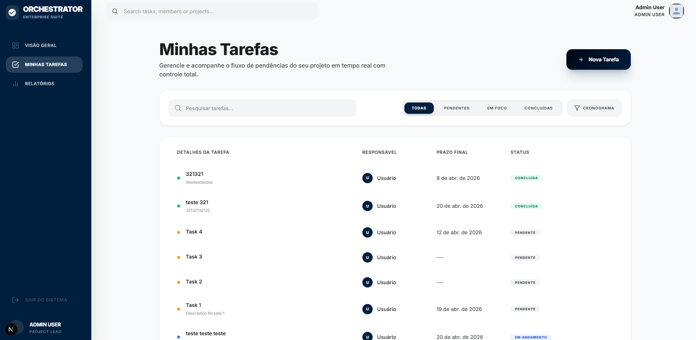
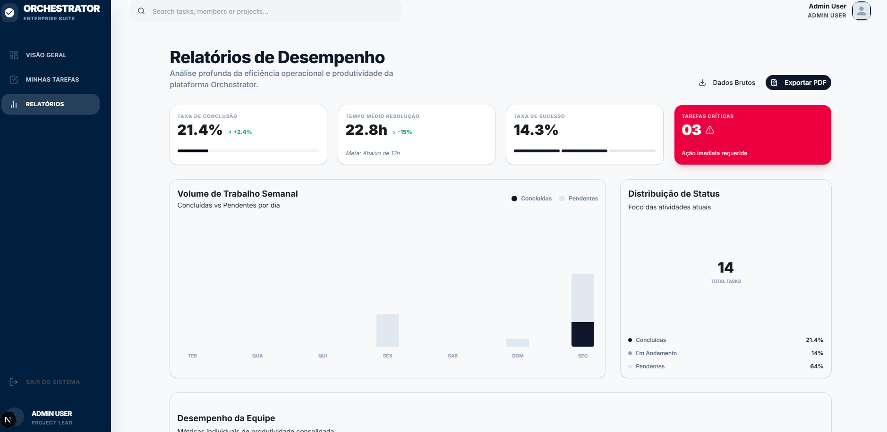
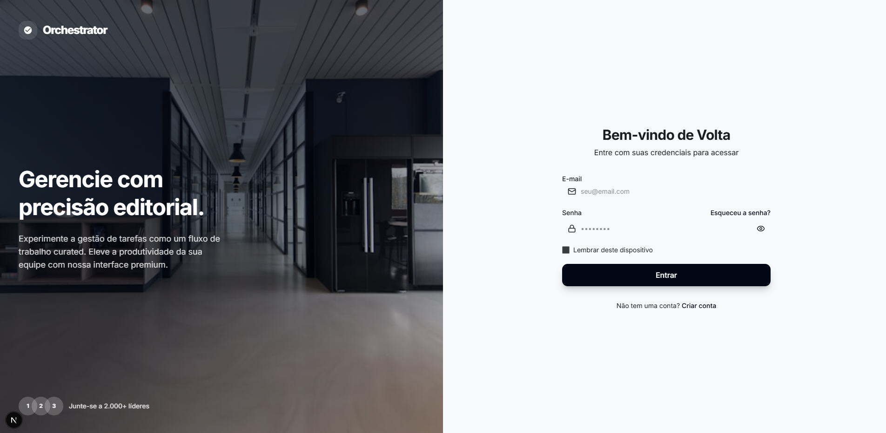

# Cubo Task Management


Este projeto é um sistema de gerenciamento de tarefas desenvolvido para um desafio técnico. O objetivo foi criar uma aplicação funcional e bem estruturada, unindo uma API robusta em Laravel com uma interface moderna em Next.js para facilitar a organização de atividades e visualização de dados.

---

## 🛠 Tecnologias Utilizadas

O projeto foi construído com ferramentas modernas para garantir um bom desempenho e facilidade de manutenção.

| Camada | Tecnologia | Propósito |
| :--- | :--- | :--- |
| **Backend** | Laravel 13 (PHP 8.4) | API e lógica de negócio |
| **Frontend** | Next.js (React) | Interface do usuário e consumo de API |
| **Banco de Dados** | MySQL 8.0 | Armazenamento dos dados |
| **Autenticação** | Laravel Sanctum | Controle de acesso via tokens |
| **Estilização** | Tailwind CSS | Layout e design responsivo |
| **Containerização** | Docker | Padronização do ambiente de desenvolvimento |

---

## 🚀 Como Rodar o Projeto

### Pré-requisitos

Antes de começar, você vai precisar ter instalado:
- [Docker Desktop](https://www.docker.com/products/docker-desktop/)
- Um terminal (Bash ou WSL no Windows)

### Passo a Passo

1. **Clone o repositório:**
   ```bash
   git clone https://github.com/seu-usuario/cubo-task-management.git
   cd cubo-task-management
   ```

2. **Execute o script de configuração:**
   Este script vai configurar os arquivos `.env`, subir os containers e rodar as migrações automaticamente.
   ```bash
   chmod +x setup.sh
   ./setup.sh
   ```

3. **Acesse as URLs:**
   - **Frontend:** [http://localhost:3000](http://localhost:3000)
   - **Backend API:** [http://localhost:8000](http://localhost:8000)
   - **Swagger (Docs API):** [http://localhost:8000/api/documentation](http://localhost:8000/api/documentation)

---

## 📸 Capturas de Tela

### Dashboard
Resumo das tarefas com indicadores de progresso e volume semanal.


### Lista de Tarefas
Gerenciamento completo das atividades com filtros de busca.


### Relatórios
Área para exportação de dados em formatos PDF e CSV.


### Login
Sistema de autenticação integrado.


---

## 📂 Estrutura do Projeto

```text
├── backend/            # Lógica da API Laravel
├── frontend/           # Interface Next.js
├── docker/             # Configurações de containers
├── screenshots/        # Imagens da interface
└── setup.sh            # Script de setup rápido
```

Documentações específicas de cada parte:
- 💡 [Backend](./backend/README.md)
- 🎨 [Frontend](./frontend/README.md)

---

## 📝 Qualidade e Testes

- **Código:** Segue os padrões PSR-12 para PHP.
- **Testes:** Foram implementados testes automatizados com PHPUnit para as funcionalidades principais.
- **Documentação:** A API está totalmente documentada via Swagger/OpenAPI.

Desenvolvido para fins de desafio técnico.
